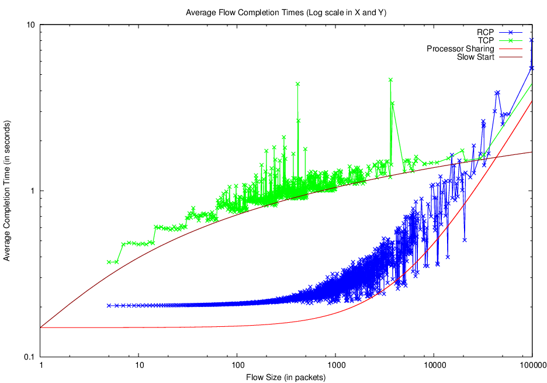
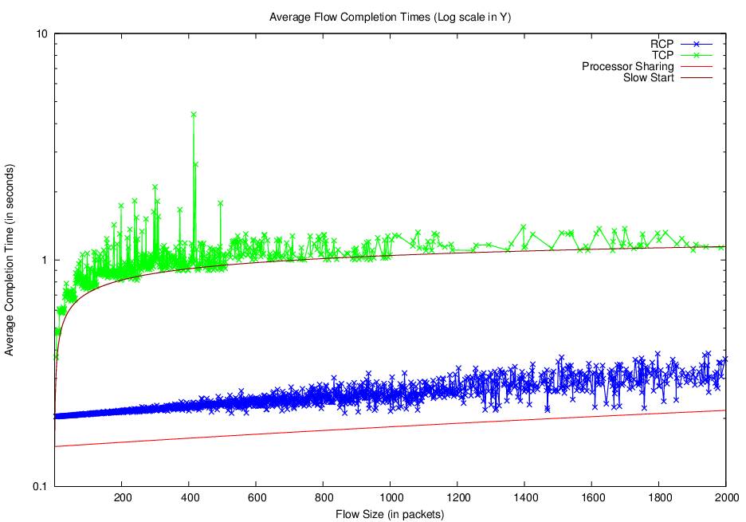

## Running Tests (Reproduction of Original Paper Results) ##
Reproduction scripts are intended for use Linux or Mac OS only. Do not attempt to run on EC2, as virtualization will break down.

 1. Clone this repository: [github.com/victorkp/rcp-ns2-result-reproduction](https://github.com/victorkp/rcp-ns2-result-reproduction)
 2. If you are on Mac OS, or a non-Debian, non-RedHat based Linux, install Vagrant and VirtualBox. If you are using Debian/Ubuntu, or RedHat/Fedora/CentOS, our run-all.sh  script should handle installation of Vagrant and VirtualBox for you.
 3. cd into the repository directory, and run ./run-all.sh
   a. This spins up a virtual machine using Vagrant, installs all required packages in the VM, downloads, patches, and compiles ns-2.35 with RCP, runs tests, and generates charts from those results. All outputted traces and charts are seamlessly synced back to the host operating system, thanks to Vagrant.
   b. Note that this will take roughly 40 minutes, although this depends on you computer’s network throughput and compute performance.

Note for those reproducing on computers with under 6GB of memory: 
the current Vagrantfile setup tries to use 4GB of RAM for the virtual machine. Consider reducing memory usage in the Vagrantfile. See the “config.vm.customize” attribute.

## Sample Results: ##

